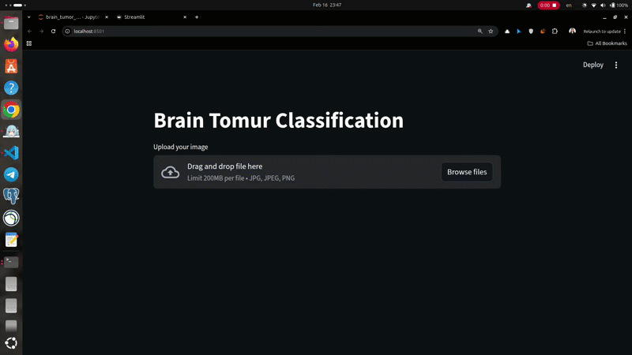
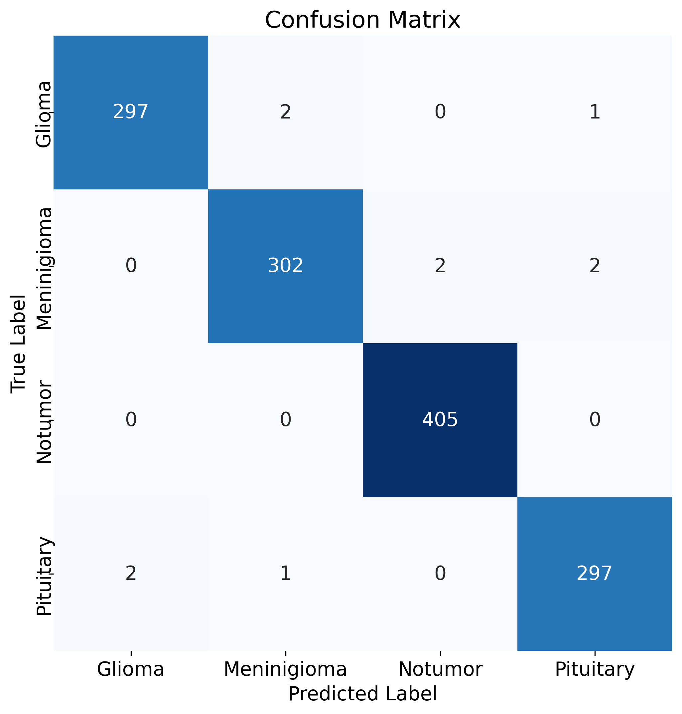
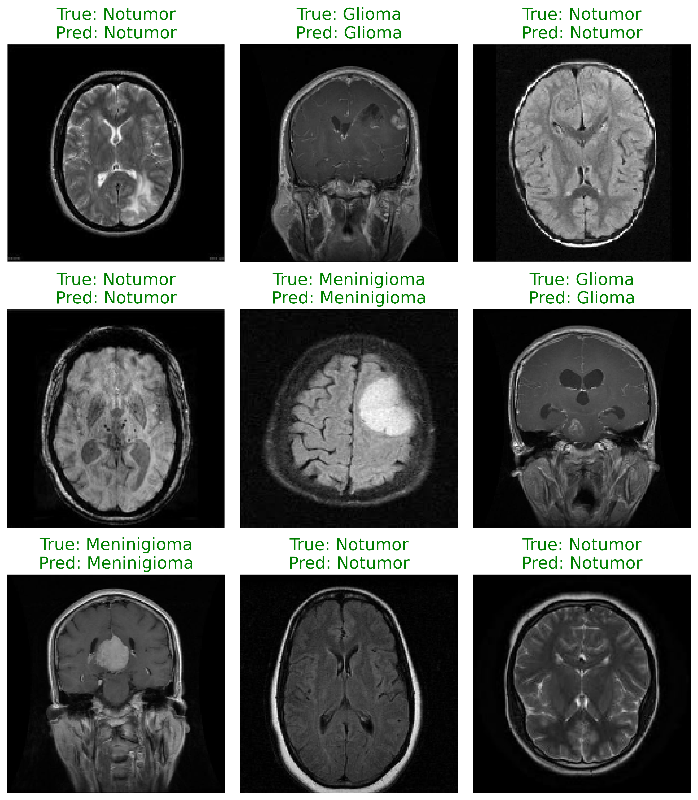

# ‌Brain Tumor Classifier-Dockerized Streamlit App
Brain tumor classification using MRI images with TensorFlow Keras


Multi-class brain tumor classification (Glioma, Meningioma, Pituitary, No Tumor) from MRI images using a custom CNN in TensorFlow, packaged with a **fully Dockerized Streamlit inference application** (GPU support included).

<p align="center">
  
</p>

## Dataset

- **Name**: Brain Tumor MRI Dataset
- **Images**: 7,200  
- **Classes**: 8 (`Glioma`, `Meningioma`, `Pituitary tumor', `No tumor`)  
- **Source**: [Kaggle - Brain Tumor MRI Dataset](https://www.kaggle.com/datasets/masoudnickparvar/brain-tumor-mri-dataset?resource=download)  
- **Split**:  
  - Train: 70%   
  - Test: 30%


## ✨ Project Highlights

- Modular code structure (`src/` layout)
- Professional data pipeline with `tf.data` + augmentation
- Real-time inference web app built with Streamlit
- **Complete Docker + Docker Compose** deployment (GPU-ready)
- Pre-trained best model included (~6 MB) – no need to retrain to run the demo
- Production-ready containerization

## 🚀 Quick Deployment (Recommended)

### Using Docker Compose (simplest & cleanest)

```bash
# Build and run (GPU)
docker compose up --build

# Run in background
docker compose up -d
```
Then open in your browser: http://localhost:8501

### Using plain Docker
``` bash
# Build
docker build -t brain-tumor-app:tf-gpu .

# Run with GPU
docker run --gpus all -p 8501:8501 brain-tumor-app:tf-gpu

# Run on CPU only
docker run -p 8501:8501 brain-tumor-app:tf-gpu
```

### 🖥️ Local Run (without Docker)
```bash
# Install dependencies
pip install -r requirements.txt

# Launch the Streamlit app
streamlit run src/app.py
```

### Optional: Retrain the model locally
```bash
python -m src.train
```

### 📊 Model Performance

| Metric    | Value |
| -------- | ------- |
| Best Validation Accuracy  | 99.35%    |
| Test Accuracy | 98.9%     |

### Visual Result
Confusion Matrix


Sample predictions with true vs predicted labels


### 🛠️ Tech Stack

- TensorFlow 2.16.1 + Keras
- Streamlit 1.51.0
- Docker & Docker Compose
- Python 3.11
- NumPy, Matplotlib, Seaborn, scikit-learn

### 📁 Project Structure
``` text
brain-tumor-classification/
├── Dockerfile
├── docker-compose.yml
├── requirements.txt
├── src/
│   ├── app.py              # Streamlit inference application
│   ├── train.py            # Training script
│   ├── data.py
│   ├── preprocess.py
│   ├── model.py
│   └── utils.py
├── models/
│   └── best_model.keras    # Final best model (~6 MB – included)
├── notebooks/              # Exploratory notebooks (optional)
└── README.md
```
### If you find this project useful, please consider giving it a star ⭐